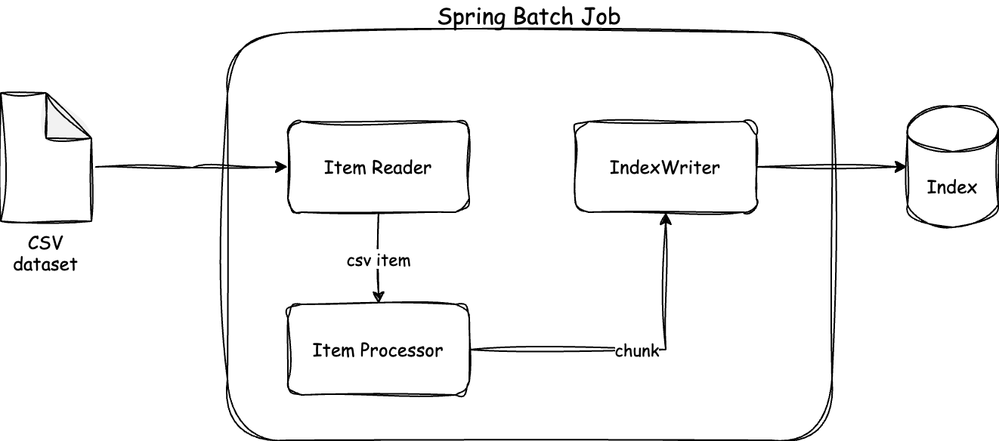

# spring-batch-parallel-processing-example

For this example I'm using the [goodbooks-10k dataset](https://github.com/zygmuntz/goodbooks-10k) - that contains six million ratings for ten thousand most popular books. I'll parse the CSV books dataset with individual book data about the author, year of publication, title, etc. Then I'll use Apache Lucene to write the book data into a searchable index.

